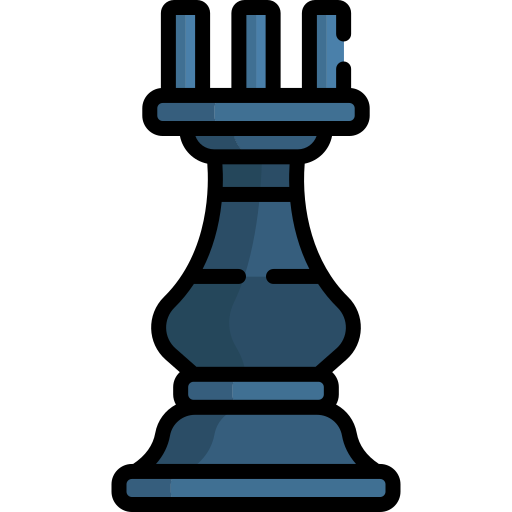
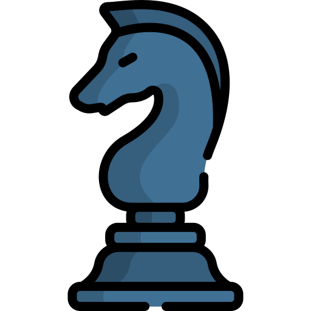
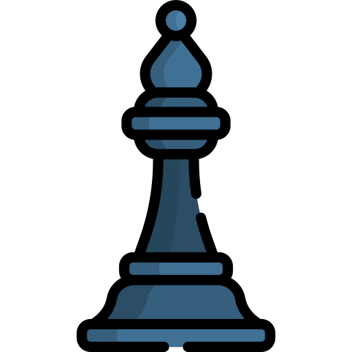
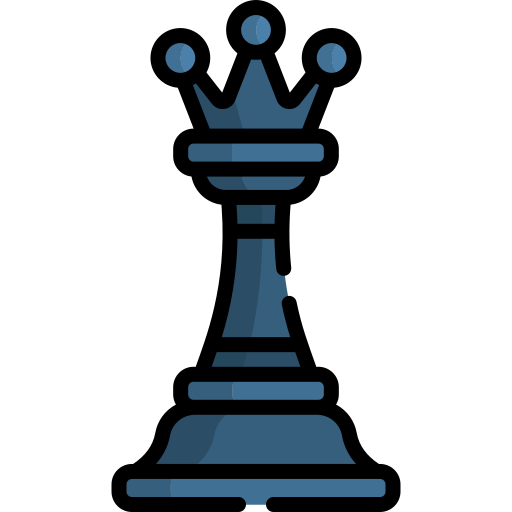
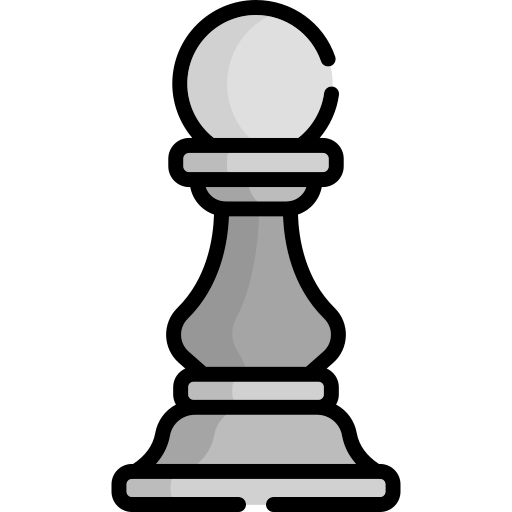
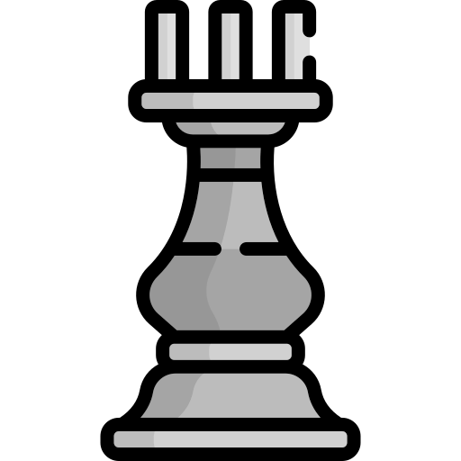
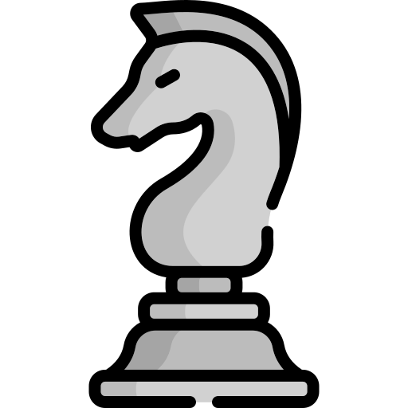
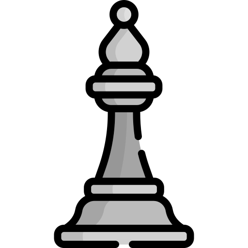
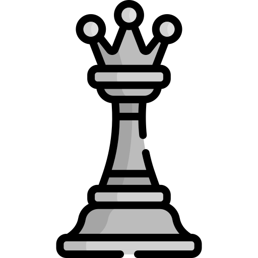
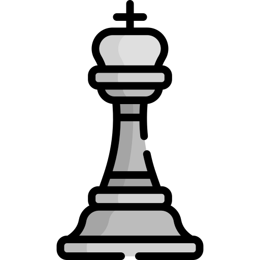

# Hey! I'm Aaron, a student from England.

- 🔭 I’m currently working on some Discord bots for a server with me and my friends in.

- 🌱 I’m currently learning Node.js and Discord.js

- ❓ Ask me about anything related to Red Dwarf, I'll know it!

- ⚡ Fun fact: I play piano! And I *think* I can play it pretty well too!

<br/>

[](https://discord.com/users/689805100331696149)

<!--START_SECTION:waka-->

```text
HTML         13 mins         ███████████████░░░░░░░░░░   60.16 %
JavaScript   8 mins          █████████▓░░░░░░░░░░░░░░░   38.11 %
JSON         0 secs          ▒░░░░░░░░░░░░░░░░░░░░░░░░   00.96 %
CSS          0 secs          ▒░░░░░░░░░░░░░░░░░░░░░░░░   00.77 %
```

<!--END_SECTION:waka-->

# Fancy a game of chess?

This is an open chess tournament where ANYONE can play. That's the fun part.  
It's your turn to play! Move a <!-- BEGIN TURN -->white<!-- END TURN --> piece.

<!-- BEGIN CHESS BOARD -->
|   | A | B | C | D | E | F | G | H |   |
|---|:-:|:-:|:-:|:-:|:-:|:-:|:-:|:-:|:-:|
| **8** |  |  |  |  |  |  |  |  | **8** |
| **7** |  |  |  |  |  |  |  |  | **7** |
| **6** |  |  |  |  |  |  |  |  | **6** |
| **5** |  |  |  |  |  |  |  |  | **5** |
| **4** |  |  |  |  |  |  |  |  | **4** |
| **3** |  |  |  |  |  |  |  |  | **3** |
| **2** |  |  |  |  |  |  |  |  | **2** |
| **1** |  |  |  |  |  |  |  |  | **1** |
|   | **A** | **B** | **C** | **D** | **E** | **F** | **G** | **H** |   |
<!-- END CHESS BOARD -->

**It's your turn to move! Choose one from the following table**
<!-- BEGIN MOVES LIST -->
|  FROM  | TO (Just click a link!) |
| :----: | :---------------------- |
| **A2** | [A3](https://github.com/ilikecheesybread/ilikecheesybread/issues/new?body=Please+do+not+change+the+title.+Just+click+%22Submit+new+issue%22.+You+don%27t+need+to+do+anything+else+%3AD&title=Chess%3A+Move+A2+to+A3), [A4](https://github.com/ilikecheesybread/ilikecheesybread/issues/new?body=Please+do+not+change+the+title.+Just+click+%22Submit+new+issue%22.+You+don%27t+need+to+do+anything+else+%3AD&title=Chess%3A+Move+A2+to+A4) |
| **B1** | [A3](https://github.com/ilikecheesybread/ilikecheesybread/issues/new?body=Please+do+not+change+the+title.+Just+click+%22Submit+new+issue%22.+You+don%27t+need+to+do+anything+else+%3AD&title=Chess%3A+Move+B1+to+A3), [C3](https://github.com/ilikecheesybread/ilikecheesybread/issues/new?body=Please+do+not+change+the+title.+Just+click+%22Submit+new+issue%22.+You+don%27t+need+to+do+anything+else+%3AD&title=Chess%3A+Move+B1+to+C3) |
| **B2** | [B3](https://github.com/ilikecheesybread/ilikecheesybread/issues/new?body=Please+do+not+change+the+title.+Just+click+%22Submit+new+issue%22.+You+don%27t+need+to+do+anything+else+%3AD&title=Chess%3A+Move+B2+to+B3), [B4](https://github.com/ilikecheesybread/ilikecheesybread/issues/new?body=Please+do+not+change+the+title.+Just+click+%22Submit+new+issue%22.+You+don%27t+need+to+do+anything+else+%3AD&title=Chess%3A+Move+B2+to+B4) |
| **C2** | [C3](https://github.com/ilikecheesybread/ilikecheesybread/issues/new?body=Please+do+not+change+the+title.+Just+click+%22Submit+new+issue%22.+You+don%27t+need+to+do+anything+else+%3AD&title=Chess%3A+Move+C2+to+C3), [C4](https://github.com/ilikecheesybread/ilikecheesybread/issues/new?body=Please+do+not+change+the+title.+Just+click+%22Submit+new+issue%22.+You+don%27t+need+to+do+anything+else+%3AD&title=Chess%3A+Move+C2+to+C4) |
| **D2** | [D3](https://github.com/ilikecheesybread/ilikecheesybread/issues/new?body=Please+do+not+change+the+title.+Just+click+%22Submit+new+issue%22.+You+don%27t+need+to+do+anything+else+%3AD&title=Chess%3A+Move+D2+to+D3), [D4](https://github.com/ilikecheesybread/ilikecheesybread/issues/new?body=Please+do+not+change+the+title.+Just+click+%22Submit+new+issue%22.+You+don%27t+need+to+do+anything+else+%3AD&title=Chess%3A+Move+D2+to+D4) |
| **E2** | [E3](https://github.com/ilikecheesybread/ilikecheesybread/issues/new?body=Please+do+not+change+the+title.+Just+click+%22Submit+new+issue%22.+You+don%27t+need+to+do+anything+else+%3AD&title=Chess%3A+Move+E2+to+E3), [E4](https://github.com/ilikecheesybread/ilikecheesybread/issues/new?body=Please+do+not+change+the+title.+Just+click+%22Submit+new+issue%22.+You+don%27t+need+to+do+anything+else+%3AD&title=Chess%3A+Move+E2+to+E4) |
| **F2** | [F3](https://github.com/ilikecheesybread/ilikecheesybread/issues/new?body=Please+do+not+change+the+title.+Just+click+%22Submit+new+issue%22.+You+don%27t+need+to+do+anything+else+%3AD&title=Chess%3A+Move+F2+to+F3), [F4](https://github.com/ilikecheesybread/ilikecheesybread/issues/new?body=Please+do+not+change+the+title.+Just+click+%22Submit+new+issue%22.+You+don%27t+need+to+do+anything+else+%3AD&title=Chess%3A+Move+F2+to+F4) |
| **G1** | [F3](https://github.com/ilikecheesybread/ilikecheesybread/issues/new?body=Please+do+not+change+the+title.+Just+click+%22Submit+new+issue%22.+You+don%27t+need+to+do+anything+else+%3AD&title=Chess%3A+Move+G1+to+F3), [H3](https://github.com/ilikecheesybread/ilikecheesybread/issues/new?body=Please+do+not+change+the+title.+Just+click+%22Submit+new+issue%22.+You+don%27t+need+to+do+anything+else+%3AD&title=Chess%3A+Move+G1+to+H3) |
| **G2** | [G3](https://github.com/ilikecheesybread/ilikecheesybread/issues/new?body=Please+do+not+change+the+title.+Just+click+%22Submit+new+issue%22.+You+don%27t+need+to+do+anything+else+%3AD&title=Chess%3A+Move+G2+to+G3), [G4](https://github.com/ilikecheesybread/ilikecheesybread/issues/new?body=Please+do+not+change+the+title.+Just+click+%22Submit+new+issue%22.+You+don%27t+need+to+do+anything+else+%3AD&title=Chess%3A+Move+G2+to+G4) |
| **H2** | [H3](https://github.com/ilikecheesybread/ilikecheesybread/issues/new?body=Please+do+not+change+the+title.+Just+click+%22Submit+new+issue%22.+You+don%27t+need+to+do+anything+else+%3AD&title=Chess%3A+Move+H2+to+H3), [H4](https://github.com/ilikecheesybread/ilikecheesybread/issues/new?body=Please+do+not+change+the+title.+Just+click+%22Submit+new+issue%22.+You+don%27t+need+to+do+anything+else+%3AD&title=Chess%3A+Move+H2+to+H4) |
<!-- END MOVES LIST -->

Having fun? Ask a friend to do the next move!

Have you spotted a bug? Something missing? Feel free to open an [issue](https://github.com/ilikecheesybread/ilikecheesybread/issues) and I will try to fix it as soon as possible :D


<details>
  <summary>Last 5 moves in this game</summary>
<!-- BEGIN LAST MOVES -->

| Move | Author |
| :--: | :----- |
| `Start game` | [ @ilikecheesybread](https://github.com/ilikecheesybread) |

<!-- END LAST MOVES -->
</details>

<details>
  <summary>Top 10 most moves across all games</summary>
<!-- BEGIN TOP MOVES -->

| Total moves |  User  |
| :---------: | :----- |

<!-- END TOP MOVES -->
</details>

---

Do you want to make your own? Check out [marcizhu/readme-chess](https://github.com/marcizhu/readme-chess)!
</br>
Made with ❤ and VSCode 

I use HŸPE for statistics. Nothing about them links it to you though! see [here](https://yhype.me/) for more info.
